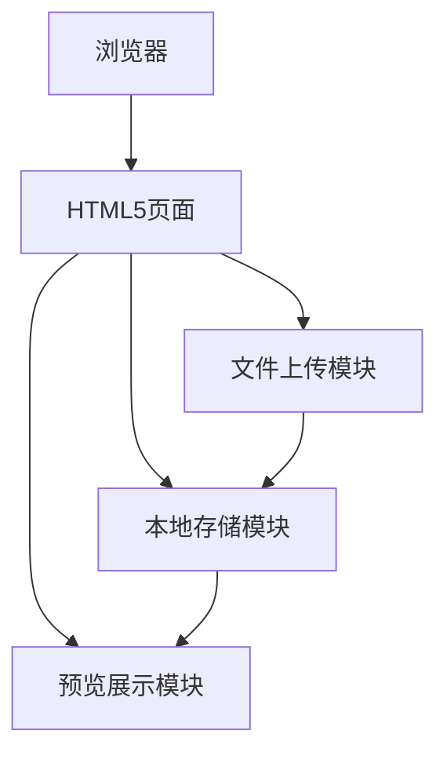
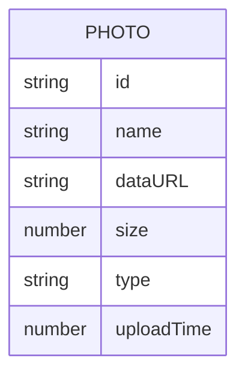

## 1. Architecture Design
纯前端应用，使用本地存储管理上传的照片



## 2. Technology Description
- **前端**: 原生 HTML5 + CSS3 + JavaScript
- **初始化工具**: 手动创建（单页面应用）
- **后端**: 无需后端
- **数据库**: 浏览器本地存储 (LocalStorage)
- **存储**: FileReader API + 本地存储

## 3. Route Definitions
| Route | Purpose |
|-------|---------|
| / | 首页，包含所有功能 |

## 4. API Definitions
无需后端API

## 5. Server Architecture Diagram
无需后端服务器

## 6. Data Model

### 6.1 Data Model Definition


### 6.2 Data Structure
照片数据将以JSON格式存储在LocalStorage中:
```javascript
// 照片数据结构
{
  id: "unique-id",
  name: "photo.jpg",
  dataURL: "data:image/jpeg;base64,...",
  size: 1024000,
  type: "image/jpeg",
  uploadTime: 1690000000000
}
```
