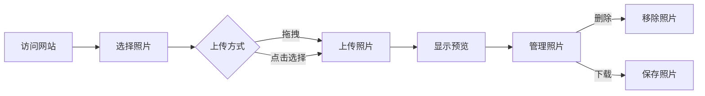

## 1. Product Overview
一个美观、现代化的网页版照片上传网站，支持拖拽上传、预览和管理照片
- 为用户提供简洁直观的照片上传体验，支持多种上传方式
- 目标是打造一个视觉精美、功能完整的照片管理平台

## 2. Core Features

### 2.1 User Roles
无需用户登录，所有用户均可使用上传功能

### 2.2 Feature Module
1. **首页**: 上传区域、照片预览网格、功能说明
2. **上传功能**: 拖拽上传、点击选择、多文件支持
3. **预览功能**: 照片网格展示、删除功能、下载功能

### 2.3 Page Details
| Page Name | Module Name | Feature description |
|-----------|-------------|---------------------|
| 首页 | Hero区域 | 网站标题、副标题、引导说明 |
| 首页 | 上传区域 | 拖拽上传框、文件选择按钮、支持格式提示 |
| 首页 | 照片预览 | 网格布局、悬停效果、操作按钮 |
| 首页 | 功能说明 | 简洁的使用说明卡片 |

## 3. Core Process
用户访问网站 → 选择或拖拽照片 → 上传成功后显示预览 → 可以删除或下载照片

## 4. User Interface Design
### 4.1 Design Style
- **主色调**: 温暖的珊瑚红 (#FF6B6B) 搭配薄荷绿 (#4ECDC4)
- **辅助色**: 柔和的米白色背景 (#FAFAFA)，深色文字 (#2D3436)
- **按钮风格**: 圆润的胶囊形按钮，带有微妙的阴影和悬停效果
- **字体**: Playfair Display (标题) + Poppins (正文)
- **布局风格**: 卡片式布局，充足的留白，视觉层次分明
- **动画效果**: 流畅的过渡动画，加载状态，悬停反馈

### 4.2 Page Design Overview
| Page Name | Module Name | UI Elements |
|-----------|-------------|-------------|
| 首页 | Hero区域 | 大标题居中，渐变色文字，装饰性图标 |
| 首页 | 上传区域 | 虚线边框容器，图标 + 文字提示，拖拽高亮效果 |
| 首页 | 照片预览 | 响应式网格，卡片悬停动画，操作按钮淡入 |
| 首页 | 功能说明 | 三列卡片布局，图标 + 简短描述 |

### 4.3 Responsiveness
- **桌面优先**设计，完全响应式布局
- 移动端优化：单列布局，触摸友好的按钮尺寸
- 自适应断点：移动端 (< 640px)、平板 (640px-1024px)、桌面 (> 1024px)

### 4.4 3D Scene Guidance
本项目不涉及3D场景
